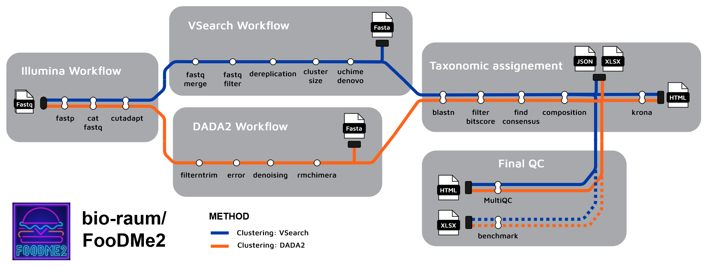

# FooDMe2

FooDMe2 (Food DNA Metabarcoding) is a Nextflow pipeline for procesing of metabarcoding data, especially developed for 
applications in the analyis of food and feed products authenticity, or similar materials and applications.

It is designed to be easily installed and used, and work on a wide range of configuration.

*The full documentation is available from the [homepage](https://bio-raum.github.io/FooDMe2)*

## Highlights

- ready-to-use reports
- pre-configured experiments parameters for common aplications
- automatic handling of reference databases
- requires only Nextflow and a container/environement manager to run
- easy deployment on a variety of configuartions through containerization

## Acknowledgements

The FooDMe2 team gratefully acknowledges the contributions made to FooDMe1, by its (former) developers as well as the user community. We hope to continue this fruitful collaboration with FooDMe2. 

With our switch to Nextflow, we happily acknowledge the use of design principles and code snippets from the [nf-co.re](https://nf-co.re/) project, whose fundamental contributions to the Nextflow community has greatly influenced our work on FooDMe2. 

## Developer team

FooDMe2 is developed and supported by the following people and organizations:

[Grégoire Denay](https://github.com/gregdenay), Chemisches und Veterinäruntersuchungsamt Rhein-Ruhr-Wupper, [CVUA RRW](https://www.cvua-rrw.de/)

[Marc Höppner](https://github.com/marchoeppner), Landeslabor Schleswig-Holstein, [LSH](https://www.schleswig-holstein.de/DE/landesregierung/ministerien-behoerden/LLABOR)
