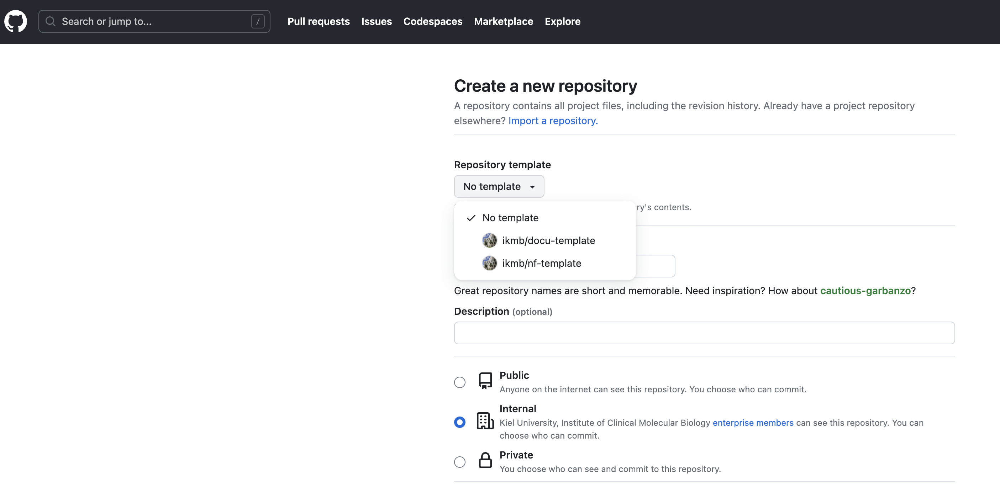

# Developer's guide

This document is a brief overview of how to use this code base. Some understanding of Nextflow and how it implements DSL2 is assumed.

- [Editor](#editor)
- [Basic concepts](#basic-concept)
- [Config files](#config-files)
- [Groovy libraries](#groovy-libraries)
- [Bioconda](#biocondabiocontainers)
- [Github workflows](#github-workflows)
- [How to start](#how-to-start)
- [How to test](#how-to-test)
- [Adding a new primer set](#adding-a-new-primer-set)

## Editor

I personally recommend [Microsoft Visual Studio Code](https://code.visualstudio.com/download) for working on nextflow pipelines. It's free and comes with a variety of free extensions to support your work.

This template specifically is set up to work with the following VS extensions:

- nextflow
- prettier
- groovy-lint
- TODO highlight
- Docker

## Basic concept

This pipeline base is organized in the following way:

* `main.nf` - entry point into the pipeline, imports the core workflow from `workflow/<pipeline>.nf`
* `workflow/<pipeline.nf>` - the actual core logic of the pipeline; imports sub-workflows from `subworkflow/<sub>.nf`
* `subworkflow/<sub>.nf` - a self-contained processing chain that is part of the larger workflow (e.g. read alignment and dedup in a WGS calling workflow)
* `modules/<module>.nf` - A command line tool/call that can be imported into a (sub)workflow.

## Config files

Some aspects of this code base are controlled by config files. These are:

/nextflow.config -  this sets some of the command line options and default values

/conf/resources.config - here you can put some pipeline-internal options, like locations of reference files and the like (assuming you use a generic base directory with fixed folder structure or S3 buckets)

/conf/base.config - this file sets the computing specifications for different types of processes.

/conf/lsh.config - this is an example of a site-specific config file (set as "standard" profile in nextflow.config), in which you can provide information about your compute environment. Make sure to create a new profile for it too.

## Groovy libraries

This pipeline imports a few functions into the nextflow files from lib/ - mostly to keep the actual pipeline code a bit cleaner/more readable. For example,
the `--help` command line option can be found in lib/WorkflowMain.groovy. Likewise, you could use this approach to do some basic validation of your inputs etc.

## Bioconda/biocontainers

By design, modules should provide software as either conda environment or container. See existing modules for how that can be achieved.

```bash
conda 'bioconda::multiqc=1.19'
container "${ workflow.containerEngine == 'singularity' && !task.ext.singularity_pull_docker_container ?
    'https://depot.galaxyproject.org/singularity/multiqc:1.19--pyhdfd78af_0' :
    'quay.io/biocontainers/multiqc:1.19--pyhdfd78af_0' }"
```

What does this do? Basically, if conda is enabled as software provider, the specified package will be installed into a process-specific environment. Else, a container is pulled - where the source depends on whether you run Docker (native Docker image) or e.g. Singularity (dedicated singularity image).

We normally use Bioconda as the source for software packages; either directly via conda or through containers that are built directly from Bioconda. You'll note that each Bioconda package lists the matching Biocontainer link.
For convenience, it is recommended to provide links to the native Biocontainer Docker container as well as the singularity version hosted by the Galaxy team under [https://depot.galaxyproject.org/singularity/](https://depot.galaxyproject.org/singularity/).

There are two situations where this approach will not work (directly). One is the use of multiple software packages in one pipeline process. While this can be done for conda-based provisioning by simply providing the name of multiple packages, it does not work for pre-built containers.
Instead, you need a so-called "mulled" container; which are built from two or more Bioconda packages - described [here](https://github.com/BioContainers/multi-package-containers). Sometimes you can be lucky and find existing mulled containers that do what you need. Else - see the description above.

If mulling containers is not an option, you can also refer to github actions and have the pipeline built its own mulled container. For that, see the section about Docker below.

## Github workflows

Github supports the automatic execution of specific tasks on code branches, such as the automatic linting of the code base or building and pushing of Docker containers. To add github workflows to your repository, place them into the sub-directory `.github/workflows`.

### Docker containers

In order to automatically push Docker containers, you must add your docker username and API token as secrets to your repository (DOCKERHUB_USERNAME and DOCKERHUB_TOKEN). Secrets can be created under Settings/Secrets and Variables/Actions.
Of course, you also need to have an account on Dockerhub and generate a permanent token.  The relevant workflow actions are included in `dot_github/workflows`.
These will read the `Dockerfile` from the root of this repository, import environment.yml (if you wish to install conda packages into the container), build the whole thing and push the container to an appropriate dockerhub repository

### Linting

Nextflow does not have a dedicated linting tool. However, since most of nextflow is actually Groovy, the groovy linting suite works just fine, I find. Linting is set up as an automatic workflow for every push to the TEMPLATE and dev branch as well as pull requests.
You may wish to run this stand-alone also, before you commit your code. I would strongly recommend setting this up in a [conda](https://github.com/conda-forge/miniforge) environment, but it should also work on your *nix system directly (albeit with some minor pitfalls re: java version).

```bash
conda create -n nf-lint nodejs openjdk=17.0.10 flake8
conda activate nf-lint
npm install -g npm-groovy-lint
```

In your pipeline directory, you can check all the files in one go as follows:

```bash
npm-groovy-lint
flake8
```

You'll note that some obvious errors/warnings are omitted. This behavior is controlled by the settings in .groovylintrc [documentation](https://www.npmjs.com/package/npm-groovy-lint), included with this template. If you need to switch on some stuff, just add it the config file - and vice-versa.

Make sure that the local linting produces *no* messages (info, warning, error) or the automatic action will throw an error and flag the commit as "failed linting". This is not a deal breaker, but in principle should be fixed before merging into the `main` branch.

## How to start

1. Create a new repository and use this template



2. Checkout the new repository

After checking out the repo, create a branch "dev" as well as "main"

```bash
git branch dev
git branch main
```
With these branches created, switch to the dev branch and start developing.

```bash
git checkout dev
```

3. Go through the source files and address the sections marked with `//TODO`

- Update `nextflow.config' with the name and version of your pipeline, required nextflow version and so on
- Rename the main workflow file and workflow definition to match your pipeline topic (and update main.nf accordingly)
- If you want to provision a pipeline-specific Docker container
  - rename dot_github to .github
  - Create a dockerhub project for this pipeline
  - Update the github actions to the name of the dockerhub project

  IMPORTANT: When you rename files in a git project, use `git mv`, not plain `mv` to avoid breaking the built-in file tracking of your git repo!

4. Outline your primary workflow logic in `workflow/<pipeline.nf>`

5. Start outlining your subworkflows, if any, in `subworkflows/<subworkflow.nf>`

6. Build all the necessary modules in `modules/`, using `modules/fastp/main.nf` as a template
   - Use a subfolder for each software package and folders therein for sub-functions of a given tool (e.g. samtools)
   - Each module should include a `conda/container` statement to specify which software package is to be used
   - Each module should collect information on the software version(s) of the tools used - see existing modules for examples.

## How to test

It is very much recommended to implement a simple test suite for your pipeline.

A default test profile is already included with this code base - you simply have to update the inputs.
These inputs should consist of a highly reduced data set that can be processes in a very short amount of time. An example would be short read data from a small section of the genome only (which you could, for example, extract from a BAM file using coordinates).
You get the idea. We try to keep test data in a [shared repository](https://github.com/marchoeppner/nf-testdata) - you might find something you can use in there, or you could add your own data set. Remember, git has a hard-limit of 50MB for individual files.

To run the test, the syntax would be:

```bash
nextflow run my/pipeline -profile standard,test
```

Here, standard refers to the default site configuration ('standard') - change it if you need to run this pipeline under a different profile.

## Sending report emails

This template is set up to send the final QC report via Email (`--email you@email.com`). This requires for sendmail to be configured on the executing node/computer.

## Adding a new primer set

Primer sets consist of one or more primer pairs, meant to be used in a given experimental setup. A primer set should target a defined region in one of the supported mitochondrial genes. Primer sets are defined in [conf/primers](../docs/primers.config) and should include the following information:

```GROOVY
'amniotes_dobrovolny' {
  description = "Amniote primer set described in Dobrovolny et al. 2019"
  gene = "lrna"
  doi = "10.1016/j.foodchem.2018.08.032"
  maxee = 2.0
  minlen = 70
  maxlen = 100
  ptrimmer_config = "${baseDir}/assets/ptrimmer/par64_illumina.txt"
  fasta = "${baseDir}/assets/primers/par64_illumina.fasta"
  taxid_filter = 32524
}
```
In addition to supporting information and tool settings, please make sure to also include the corresponding Ptrimmer and primer FASTA files (ptrimmer_config, fasta) under [assets/primers](../assets/primers).