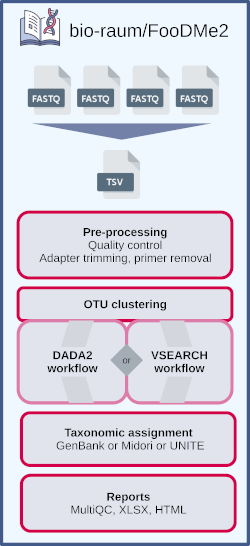

{ align=right }

# FooDMe2

FooDMe2 (Food DNA Metabarcoding) is a Nextflow pipeline for procesing of metabarcoding data, especially developed for 
applications in the analyis of food and feed products authenticity, or similar materials and applications.

It is designed to be easily installed and used, and work on a wide range of configuration.

*The full documentation is available from the [homepage](https://bio-raum.github.io/FooDMe2)*

## Highlights

- ready-to-use reports
- pre-configured experiments parameters for common aplications
- automatic handling of reference databases
- requires only Nextflow and a container/environement manager to run
- easy deployment on a variety of configuartions through containerization

## Overview

{ align=right }

FooDMe2 is a complete rewrite of [FooDMe](https://github.com/CVUA-RRW/FooDMe). We designed FooDMe 2 to be more flexible and take away some of the complexity encountered in FooDMe 1. This not only concerns the installation procedure, which is vastly streamlined now, but also the process of configuring and starting individual analysis runs.
The new implementation also maes it easier to deploy, maintain, and to add additonal functionalities in the future.

## Citation

There is no publicaiton on FooDMe2 yet. However you can still cite the original FooDMe paper:

Denay, G.; Preckel, L.; Petersen, H.; Pietsch, K.; Wöhlke, A.; Brünen-Nieweler, C. Benchmarking and Validation of a Bioinformatics Workflow for Meat Species Identification Using 16S rDNA Metabarcoding. Foods 2023, 12, 968. [https://doi.org/10.3390/foods12050968](https://doi.org/10.3390/foods12050968) 

## Acknowledgements

The FooDMe2 team gratefully acknowledges the contributions made to FooDMe1, by its (former) developers as well as the user community. We hope to continue this fruitful collaboration with FooDMe2. 

With our switch to Nextflow, we happily acknowledge the use of design principles and code snippets from the [nf-co.re](https://nf-co.re/) project, whose fundamental contributions to the Nextflow community has greatly influenced our work on FooDMe2. 

## Developer team

FooDMe2 is developed and supported by the following people and organizations:

[Grégoire Denay](https://github.com/gregdenay), Chemisches und Veterinäruntersuchungsamt Rhein-Ruhr-Wupper, [CVUA RRW](https://www.cvua-rrw.de/)

[Marc Höppner](https://github.com/marchoeppner), Landeslabor Schleswig-Holstein, [LSH](https://www.schleswig-holstein.de/DE/landesregierung/ministerien-behoerden/LLABOR)
